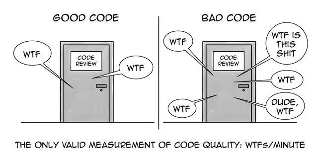
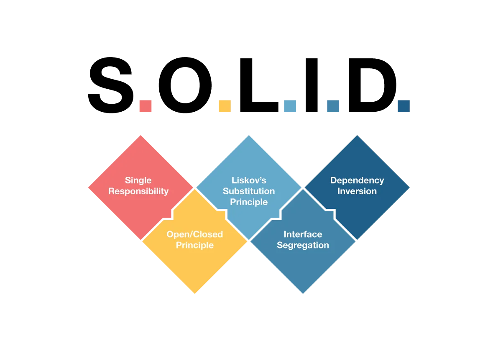
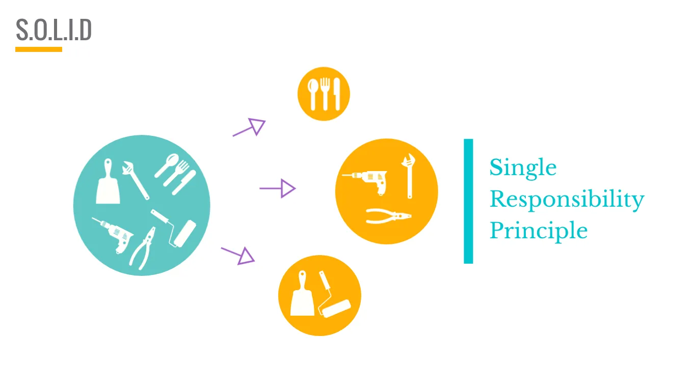
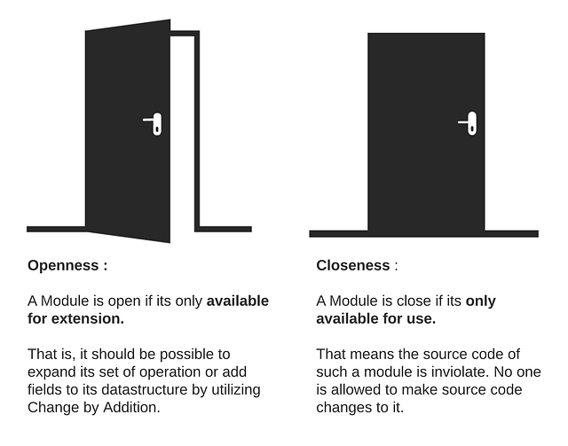
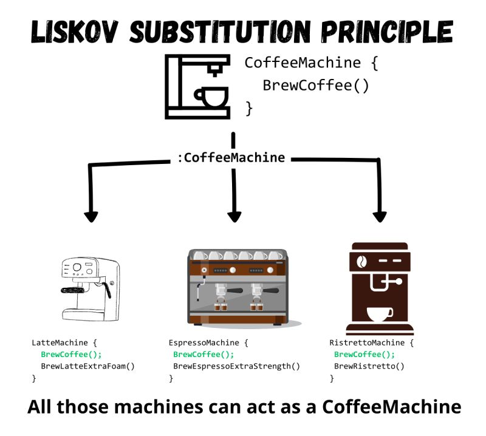
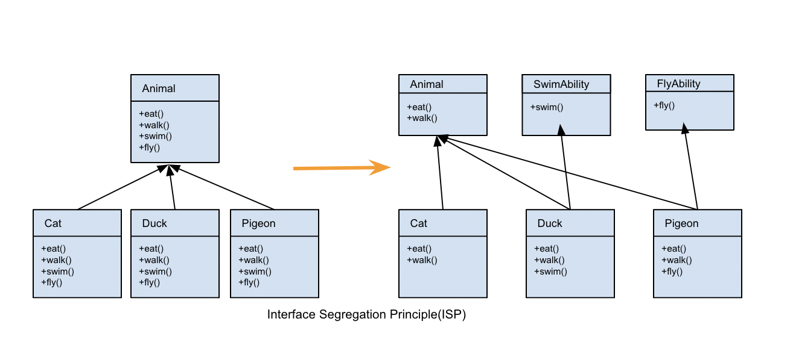
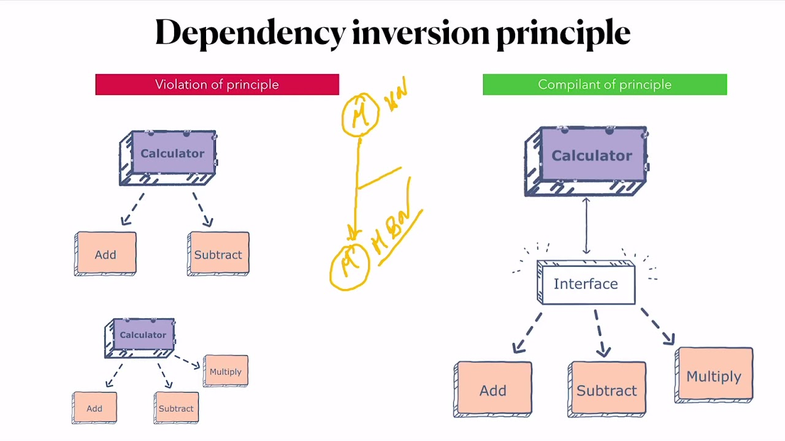
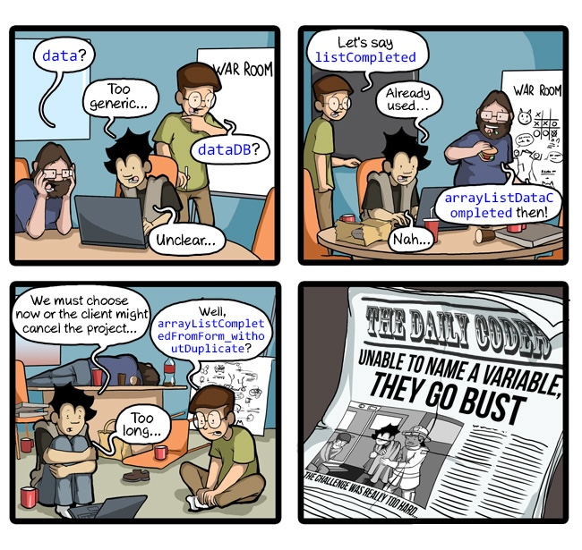

# Clean Code


编码是一种能力，而好的编码则是一个故事。本文将带你进入一些实践，这些实践可以在你的编程中轻松地实现，从而使代码更加出色。

## 什么是 Clean Code?

Clean Code 的概念可以追溯到 Robert C. Martin 和他的书《Clean Code: A Handbook of Agile Software Craftsmanship》，然而，这些原则要比这个概念提出早的做。这个概念背后的思想是编写易于理解的代码，使其更易于维护。

具体的原则在开发人员社区中是一个备受争议的话题，有些人可能同意也可能不同意其中的一些原则，但我可以说，我接下来将要介绍的原则是高度可接受的，并且根据我的个人经验，它们对于提高代码质量非常重要。

在我们开始之前，必须说明一下，这些原则是与语言无关的，所以无论你使用 Python、Java、JavaScript 或其他语言它们可以在你的代码中轻松实现。

### 为什么编写 CleanCode 很重要?



编写 CleanCode 的目的是为了提高代码质量，使其易于理解、易于维护、易于扩展和易于测试。编写 CleanCode 的另一个目的是为了提高开发人员的生产力，因为编写 CleanCode 的代码更少出错，并且更易于阅读和理解。

- 开发效率(Productivity)：编写、阅读、调试、测试和维护代码的时间和精力成本降低
- 代码质量(Quality)：更好的用户体验和客户满意度，满足功能和非功能需求
- 团队合作(Collaboration)：团队协作和知识共享变得更加容易
- 学习新技能(Learning)：帮助开发者提高技能并学习新技术，暴露最佳实践、设计模式和编码

### 编写 CleanCode 的技巧和原则包括：

- 规则：遵循规则和最佳实践，避免违反它们
- 命名：使用有意义的名称，避免使用缩写，使用易于搜索的命名
- 注释：解释代码逻辑，避免使用复杂的注释，使用文档化的注释
- 格式：使用一致的格式和风格，避免使用混乱的格式和风格
- 错误处理：优雅地处理错误，避免使用异常来处理错误
- 测试：编写单元测试和集成测试，覆盖所有代码路径，提高代码质量
- 重构：定期重构代码，保持代码的简洁和可维护性
- 文档：编写清晰的文档，包括功能描述、使用说明、设计思路和代码注释
- 团队协作：遵循代码规范和最佳实践，保持一致的代码风格和命名规范

### 童子军军规（The Boy Scout Rule）


**Always leave the code cleaner than you found it.**

这条规则由理查德·斯托曼提出，他是一位程序员和软件工程师，也是著名的软件开发思想家。

这条规则适用于编程中的所有阶段，不仅仅是版本控制。它意味着你应该始终保持代码库的整洁，无论你是在修复一个 bug 还是添加一个新的功能。或者当你发现代码中的某个问题时，应该清理它，无论谁做了它。你的任务是永远让它保持清洁，为下一个开发者（可能是你自己）带来便利。

### 破窗理论（The Broken Windows Theory）


一个破窗户，经过一段时间的不修，就会给人以疏忽的印象。更多的窗户也会被破坏，涂鸦出现，结构受损，弃置的想法出现。只需要一个破窗户，一切都会倒塌。
破窗理论认为，如果一个地方被破坏，那么人们就会习惯性地破坏其他地方。
代码中如果发现破窗，就立即进行修复，而不是等到一大堆破窗出现时再进行修复。亦或是因为项目急，而潦草提交，想着以后修改的时候，都可能会导致代码逐渐腐烂。

## S.O.L.I.D 原则



SOLID 原则是一组面向对象设计和编程的基本原则，由罗伯特·C·马丁（Bob Martin）提出，这些原则包括：

- 单一职责原则（Single Responsibility Principle, SPR）。一个类或方法应该只负责一项职责，以便于理解和维护。
- 开闭原则（Open-Closed Principle, OCP）。软件实体（如类、模块和函数）应该对扩展开放，对修改关闭，以便于系统的扩展性和稳定性。
- 里氏替换原则（Liskov Substitution Principle, LSP）。所有派生类必须可以替换基类，确保代码的稳定性和可复用性。
- 接口隔离原则（Interface Segregation Principle, ISP）。接口应该尽量小，只包含当前需要的方法，以便于提高代码的可维护性和可复用性。
- 依赖反转原则（Dependency Inversion Principle, DIP）。高层模块不应该依赖于低层模块，两者都应该依赖于抽象，以便于系统的解耦和模块的独立性。

### 单一职责原则 (SRP：Single Responsibility Principle )



这个原则规定一个类或者模块应该有且只有一个改变的原因，也就是说，一个类或者模块应该只有一个引起它变化的原因。

如果一个类或者模块承担了过多的职责，或者这些职责在概念上不紧密相关，那么这就违反了单一职责原则。这种情况下，类或者模块的变化可能会影响到它的其他职责，导致代码变得复杂、难以理解和维护。

单一职责原则的核心是控制类的粒度大小、将对象解耦、提高其内聚性。遵循这个原则可以降低类的复杂度，提高类的可读性和可维护性，降低修改程序所引入的风险。

在实际应用中，单一职责原则的实现需要设计人员发现类的不同职责并将其分离，再封装到不同的类或模块中。这个过程需要设计人员具有较强的分析设计能力和相关重构经验。同时，这个原则也适用于方法，一个方法应该尽可能做好一件事情，避免处理过多的任务，以提高代码的可重用性。

### 开闭原则 (OCP：Open Closed Principle)



它指出软件实体（如类、模块、函数等）应对扩展开放，但对修改关闭。换句话说，当软件需要变化时，应该尽量通过扩展软件实体的行为（如增加新的方法或功能）来实现变化，而不是通过修改已有的代码。

这个原则的主要目的是提高软件系统的可维护性和可扩展性，防止对现有代码的修改引入新的错误，并促进代码的重用。在软件需求频繁变更的情况下，应用开闭原则可以减少修改带来的影响。在框架和库的开发中，这个原则尤为重要，因为它们通常面临着各种需求的扩展。

遵循开闭原则可以帮助我们编写出更加灵活、可扩展的代码，使得软件系统更加健壮和易于维护。为了实现开闭原则，我们可以使用抽象来构建框架，用实现来扩展细节。当需要新增功能或形状时，只需扩展相应的类，而无需修改原有的代码。

### 里氏代换原则 (LSP：Liskov Substitution Principle)



里氏替换原则由芭芭拉·利斯科夫（Barbara Liskov）在1987年提出。这个原则定义了子类型（子类）必须能够替换其基类型（父类）的条件，即软件中的对象如果是使用基类型的话，那么无论它实际上是基类型还是子类型，程序的行为都不会改变。

里氏替换原则的主要目的是保证软件系统的稳定性和可靠性，防止因继承导致的意外行为。它规定了以下几个约束条件：

* 子类必须能够替换其父类。换句话说，在软件中，如果我们把所有的父类对象替换成子类对象，那么程序的行为应该保持不变。
* 子类必须实现父类中所有的抽象方法，但不得重写（覆盖）父类的非抽象（已实现）方法。这保证了子类不会破坏父类的行为。
* 子类中可以增加自己特有的方法。这允许子类在继承父类的基础上增加新的功能。
* 子类覆盖或实现父类的方法时，方法的前置条件（即方法的输入参数）要比父类方法的输入参数更宽松。这保证了子类方法可以接收更多的输入。
* 子类覆盖或实现父类的方法时，方法的后置条件（即方法的返回值）要比父类更严格。这保证了子类方法返回的结果更符合要求。

遵循里氏替换原则可以帮助我们编写出更加健壮、可扩展、易于维护的代码。通过确保子类能够替换其父类，我们可以减少因继承导致的错误，提高代码的可重用性和可维护性。同时，这也促进了面向对象的设计原则在软件开发中的应用。

### 接口隔离原则 (ISP：Interface Segregation Principle)



这个原则强调客户端不应该依赖它不需要的接口，也就是说，一个类对另一个类的依赖应该建立在最小的接口上。

接口隔离原则的主要目的是减少类之间的耦合度，提高系统的灵活性和可维护性。通过将臃肿的接口拆分为更小、更具体的接口，客户端只需要知道和关心它们真正使用的方法，从而减少了系统的依赖性。这也有助于避免一处修改导致多处变更的情况，提高了系统的稳定性。

接口隔离原则在实际应用中可以通过以下方式实现：

1. 使用多个专门的接口，而不使用单一的总接口。这样可以将接口拆分为更小的部分，每个接口只包含一部分功能，客户端只需要使用它们需要的接口。
2. 客户端不应该依赖它不需要的接口。这意味着在设计接口时，应该仔细考虑哪些方法是必要的，哪些方法是可选的，并将它们分别放在不同的接口中。客户端只需要实现它们真正需要的接口。
3. 类之间的依赖关系应该建立在最小的接口上。这意味着在实现类时，应该只使用它们真正需要的接口，而不是使用包含许多不必要方法的总接口。这有助于减少类之间的耦合度，提高系统的灵活性。

遵循接口隔离原则可以帮助我们编写出更加健壮、可扩展、易于维护的代码。通过将接口拆分为更小的部分，并减少类之间的耦合度，我们可以提高系统的稳定性和可维护性。同时，这也促进了面向对象的设计原则在软件开发中的应用。

### 依赖倒置原则 (DIP：Dependency Inversion Principle)



它强调高层模块不应该依赖于低层模块，两者都应该依赖于抽象。抽象不应该依赖于细节，细节应该依赖于抽象。

这个原则的核心思想是通过依赖抽象（如接口或抽象类）来减少类之间的耦合度，从而提高代码的可维护性和可扩展性。具体而言，依赖倒置原则包含以下两个方面的要求：

1. 高层模块不应该依赖于低层模块，两者都应该依赖于抽象。这意味着高层模块和低层模块之间的依赖关系应该通过抽象（如接口或抽象类）来建立，而不是通过具体的类来建立。这样可以减少类之间的耦合度，提高代码的可维护性和可扩展性。
2. 抽象不应该依赖于细节，细节应该依赖于抽象。这意味着抽象（如接口或抽象类）不应该依赖于具体的实现细节，而具体的实现细节（如具体的类）应该依赖于抽象。这样可以保证抽象的稳定性和可重用性，同时使得具体的实现细节可以更加灵活地变化。

在实际应用中，依赖倒置原则可以通过以下方式实现：

* 使用接口或抽象类来定义高层模块和低层模块之间的依赖关系，而不是使用具体的类。
* 在实现类时，让类依赖于抽象（如接口或抽象类），而不是依赖于具体的实现细节。
* 通过依赖注入（Dependency Injection）的方式，将具体的实现细节注入到需要使用它的类中，而不是让类自己负责创建和管理依赖关系。

例如，在软件开发中，如果类 A 直接依赖于类 B，那么当需要修改类 A 时，可能会影响到依赖它的其他模块。为了降低这种风险，我们可以将类 A 修改为依赖于接口 I，而类 B 和类 C 则各自实现这个接口。这样，类 A 通过接口间接与类 B 或类 C 发生联系，从而降低了对类 A 的修改需求。

遵循依赖倒置原则可以帮助我们编写出更加健壮、可扩展、易于维护的代码。通过减少类之间的耦合度，我们可以提高代码的可重用性和可测试性，同时使得代码更加灵活和易于扩展。这也是面向对象设计的一个重要目标。

## Meaningful Names



在软件开发中，命名是一项至关重要的任务，它贯穿于整个代码库，从大型项目、文件、目录到小型类、函数和局部变量。因此，给实体赋予有意义的名称对于编写清晰、可维护的代码至关重要。

### 使用意图明确的名称（Intention-Revealing Names）

选择好的名称需要投入时间和精力，但这将大大提高代码的可读性和可维护性。好的名称应该揭示变量的用途、功能和用法。如果一个名称需要额外的注释来解释，那么这个名称就没有达到其应有的目的。

下面是一个意图不明确和意图明确的命名对比表：

| 意图不明确的命名 | 意图明确的名称 |
| --- | --- |
| `d` | `elapsedTimeInDays` |

使用能够揭示意图的名称可以使代码更易于理解和修改。以下是一个示例，展示了如何通过重命名来提高代码的可读性：

```java
// 原始代码，意图不明确
public List<int[]> getThem() {
    List<int[]> list1 = new ArrayList<int[]>();
    for (int[] x : theList)
        if (x[0] == 4)
            list1.add(x);
    return list1;
}

// 重构后的代码，意图明确
public List<int[]> getFlaggedCells() {
    List<int[]> flaggedCells = new ArrayList<int[]>();
    for (int[] cell : gameBoard)
        if (cell[STATUS_VALUE] == FLAGGED)
            flaggedCells.add(cell);
    return flaggedCells;
}
```

在这个例子中，通过重命名方法和变量，我们提供了更多关于代码功能的上下文信息。这使得其他开发人员更容易理解代码的意图，而无需查看额外的文档或注释。

此外，为了进一步改进代码的可读性和可维护性，我们可以考虑使用对象来代替数组，并为这些对象编写揭示意图的方法。例如，我们可以创建一个`Cell`类来代替`int`数组，并为该类添加一个`isFlagged`方法：

```java
// 使用对象代替数组，并添加揭示意图的方法
public List<Cell> getFlaggedCells() {
    List<Cell> flaggedCells = new ArrayList<Cell>();
    for (Cell cell : gameBoard)
        if (cell.isFlagged())
            flaggedCells.add(cell);
    return flaggedCells;
}
```

通过这种方式，我们不仅可以提高代码的可读性，还可以隐藏实现细节，使代码更加模块化和可重用。

### 避免误导(Avoid Disinformation)

程序员必须避免留下误导性的线索，以免掩盖代码的意义。我们应该避免使用那些根深蒂固的意义与我们的预期意义不符的词汇。

除非实际上是一个 `List`，否则不要把一组账户称为 `accountList`。对于程序员来说，`List` 这个词有特定的含义。如果容纳账户的容器实际上不是一个 `List`，那么这可能会导致错误的结论。因此，`accountGroup` 或 `bunchOfAccounts` 或者简单的 `accounts` 会更好。

小心使用只有细微差别的名称。在一个模块中，一个名为 `XYZControllerForEfficientHandlingOfStrings` 的控制器与另一个稍微远一点的名为 `XYZControllerForEfficientStorageOfStrings` 的控制器之间，需要多长时间才能发现细微的差别？这两个词的形状惊人地相似。

### 做有意义的区分（Make Meaningful Distinctions）

当程序员编写代码只是为了满足编译器或解释器的需求时，他们会为自己制造问题。例如，由于您不能在同一个作用域中使用相同的名称来引用两个不同的对象，因此您可能会随意更改其中一个名称。有时这是通过拼写错误来实现的，导致在纠正拼写错误时无法编译的意外情况。例如，您创建了变量 `klass`，因为名称 `class` 用于其他目的。

在下一个函数中，参数没有提供有用的信息，`a1` 和 `a2` 不提供有关作者意图的线索。

```java
public static void copyChars(char a1[], char a2[]) {
  for (int i = 0; i < a1.length; i++) {
    a2[i] = a1[i];
  }
}
```

我们可以通过选择更明确的参数名称来改进代码：

```java
public static void copyChars(char source[], char destination[]) {
  for (int i = 0; i < source.length; i++) {
    destination[i] = source[i];
  }
}
```

无意义的词是另一种无意义的区别。想象一下您有一个名为 `Product` 的类。如果您还有另一个名为 `ProductInfo` 或 `ProductData` 的类，那么您已经使名称不同，但没有使它们具有不同的含义。Info 和 Data 就像 a、an 和 the 这样的无意义词。

无意义的词是冗余的。变量名称中永远不应该出现“变量”这个词。表名称中永远不应该出现“表”这个词。

### 使用读的出来的名字（Use Pronounceable Names）

想象一下你有一个变量`genymdhms`（生成日期、年份、月份、日期、小时、分钟和秒），并且想象一下在一个对话中你需要谈论这个变量，称之为“gen why emm dee aich emm ess”。你可以考虑将这样的类转换为：

```java
class DtaRcrd102 {
  private Date genymdhms;
  private Date modymdhms;
  private final String pszqint = "102";
  /* ... */
};
```

转换为

```java
class Customer {
  private Date generationTimestamp;
  private Date modificationTimestamp;
  private final String recordId = "102";
  /* ... */
};
```

在转换后的类中，变量名已经变得更加描述性，更容易理解每个变量的用途。`genymdhms` 被更改为 `generationTimestamp`，它现在明确地表示这是一个表示生成时间戳的日期。同样，`modymdhms` 被重命名为 `modificationTimestamp`，以表明它表示修改时间戳。最后，`pszqint` 被重命名为 `recordId`，以更清楚地表明这是一个表示记录 ID 的字符串常量。这样的更改使代码更易读和易维护。

### 使用可搜索出来的名字（Use Searchable Names）

单字母名称和数字常量存在一个特定的问题，即它们在一篇文本中不容易被定位。

### 避免使用编码（Avoid Encoding）

我们已经有足够的编码来处理我们的负担，无需增加更多的负担。将类型或作用域信息编码到名称中只会增加解密的额外负担。编码后的名称很少可读，且容易键入错误。一个例子就是使用[匈牙利命名法](https://en.wikipedia.org/wiki/Hungarian_notation)或者使用成员前缀。

#### 匈牙利语标记法

当然，以下是一些使用匈牙利命名法的例子：

1. **系统匈牙利命名法**：


	* `iCount`：表示一个整数类型的计数器。其中，“i”代表整数类型，“Count”描述了这个变量的用途，即计数。
	* `dblAverage`：表示一个双精度浮点类型的平均值。其中，“dbl”代表双精度浮点类型，“Average”描述了这个变量的用途，即计算平均值。
	* `strName`：表示一个字符串类型的名称。其中，“str”代表字符串类型，“Name”描述了这个变量的用途，即存储名称。
2. **匈牙利应用命名法**：


	* `fnCalculateSum`：表示一个函数，用于计算总和。其中，“fn”代表函数，“CalculateSum”描述了这个函数的功能。
	* `btnClose`：表示一个按钮，用于关闭某个界面或功能。其中，“btn”代表按钮，“Close”描述了这个按钮的作用。
	* `lblStatus`：表示一个标签，用于显示状态信息。其中，“lbl”代表标签，“Status”描述了这个标签的用途。

#### 成员前缀

成员前缀命名法是一种在编程中常见的命名约定，特别是在面向对象编程中。这种命名法的主要思想是在成员变量（包括属性、字段等）名前加上一个特定的前缀，以区分它们与其他类型的变量（如局部变量、函数参数等）。这种前缀通常表示成员变量的类型或作用域。

在常见的命名约定中，`m_` 前缀通常用于表示类的成员变量。例如，在C++或C#中，你可能会看到这样的代码：

```cpp
class MyClass {
private:
    int m_count;  // 成员变量，表示计数

public:
    void SetCount(int count) {
        m_count = count;
    }

    int GetCount() {
        return m_count;
    }
};
```

在这个例子中，`m_count` 是一个私有成员变量，用于存储计数。`m_` 前缀清楚地表明这是一个类的成员变量，而不是局部变量或函数参数。

不过，请注意，不是所有的编程语言或编程社区都遵循这种命名约定。有些语言（如Python）的社区倾向于使用不同的命名约定，比如使用下划线作为私有成员变量的前缀（`_count`），或者使用名称修饰（如`count`变为`self.count`）来表示成员变量。

此外，一些现代的编程风格指南（如Google的C++编程风格指南）可能不推荐使用`m_`前缀，而是建议直接使用变量名，并依赖于上下文来区分成员变量和其他类型的变量。


#### 接口和实现（Interfaces and Implementations）

对于编码来说，有时这是一个特殊的情况。例如，假设你正在构建一个用于创建形状的抽象工厂。这个工厂将是一个接口，将由一个具体类实现。你应该怎么命名它们呢？`IShapeFactory`和`ShapeFactory`？最好不要装饰接口。我不想让我的用户知道我正在传递一个接口给他们。我只希望他们知道这是一个`ShapeFactory`。因此，如果我必须对接口或实现进行编码，我会选择实现。将其命名为`ShapeFactoryImp`，甚至是丑陋的`CShapeFactory`，都比对接口进行编码要好。

### 避免思维映射

读者不需要将你的名称翻译成他们已知的其他名称。

聪明程序员与专业程序员之间的一个区别在于，专业程序员明白清晰性是至关重要的。专业程序员运用他们的能力来写出其他人能理解的代码。

### 类名

类和对象应该使用名词或名词短语作为名称，如`Customer`、`WikiPage`、`Account`和`AddressParser`。在类名中避免使用`Manager`、`Processor`、`Data`或`Info`等词。类名不应该是动词。

### 方法名

方法应该使用动词或动词短语作为名称，如`postPayment`、`deletePage`或`save`。访问器、修改器和谓词应该根据它们的值来命名，并遵循 javabean 标准，使用`get`、`set`和`is`作为前缀。

当构造函数重载时，使用静态工厂方法，并使用描述参数的名称。例如：

```java
Complex fulcrumPoint = Complex.FromRealNumber(23.0);
```

通常比以下方式更好：

```java
Complex fulcrumPoint = new Complex(23.0);
```

考虑通过使相应的构造函数为私有来强制使用静态工厂方法。

### 别扮可爱

在编程中，避免使用过于可爱或俏皮的命名方式。这样的命名可能会让其他开发者感到困惑或误解。以下是几个例子：

| 俏皮的名称        | 清晰的名称    |
| ----------------- | ------------- |
| `holyHandGranade` | `deleteItems` |
| `whack`           | `kill`        |
| `eatMyShorts`     | `abort`       |

### 每个概念一个对应词

对于每个抽象概念，应该选择一个词并坚持使用。例如，如果在不同的类中使用`fetch`、`retrieve`和`get`作为等效的方法，这会引起混淆。

### 别用双关语

避免使用同一个词来表示两个不同的概念。这种用法本质上是一种文字游戏（双关语），可能导致误解。

例如，在一个类中使用`add`来表示通过添加或连接两个现有值来创建新值，而在另一个类中使用`add`来表示将简单参数添加到集合中，更好的选择是使用`insert`或`append`等名称。

### 使用解决方案领域名称

记住，阅读你代码的人将是程序员。因此，可以大胆使用计算机科学（CS）术语、算法名称、模式名称、数学术语等。

### 使用源自所设问题领域的名称

当没有适合程序员的术语来描述你正在做的事情时，可以使用问题领域的名称。至少维护你代码的程序员可以询问领域专家这是什么意思。

### 添加有意义的语境（Add Meaningful context）

有些名称本身就有意义——但大多数并非如此。相反，你需要通过将名称放在具有良好名称的类、函数或命名空间中，来为读者提供上下文。当其他所有方法都失败时，作为最后的手段，给名称添加前缀可能是必要的。

像`firstName`、`lastName`、`street`、`city`、`state`这样的变量。把它们放在一起，很明显它们构成了一个地址，但是，如果你在一个方法中看到变量`state`被单独使用了呢？你可以通过添加像`addrState`这样的前缀来提供上下文，这样至少读者会明白这个变量是一个大结构的一部分。当然，更好的解决方案是创建一个名为`Address`的类，这样即使是编译器也知道这些变量属于一个更大的概念。

### 不要添加没有用的语境（Don’t Add Gratuitous Context）

在名为“Gas Station Deluxe”的虚构应用中，为每个类名添加“GSD”前缀是一个不好的做法，例如：`GSDAccountAddress`。

只要名称清晰明了，通常更短的名称比更长的名称更好。不要给名称添加不必要的上下文。

这个观点与之前的讨论是一致的，强调了在命名时应避免过度冗长，同时确保名称具有足够的上下文以清晰表达其意图。过度使用前缀或后缀可能会导致名称过长，难以阅读和理解。相反，应该尽量使用简短、清晰、描述性的名称，以便读者能够轻松理解代码的结构和目的。

在“Gas Station Deluxe”这个例子中，如果`AccountAddress`已经清晰地表达了其含义（即与账户相关的地址），那么就没有必要添加“GSD”前缀。这样的名称既简短又易于理解，同时保持了代码的清晰度和可维护性。

<a name="chapter3">
<h1>函数</h1>
</a>

Functions are the first line of organization in any topic.
在任何主题中，函数都是组织代码的第一道防线。

这意味着函数应该被用作组织代码的主要手段，特别是在处理复杂逻辑或大型项目时。通过将代码分解为小的、可管理的函数，可以提高代码的可读性、可维护性和可重用性。每个函数都应该有一个清晰定义的目的，并且应该尽可能地保持简洁和独立。

此外，良好的函数命名也是非常重要的。函数名应该准确地描述函数的功能，这样其他开发者在阅读代码时就能够更容易地理解每个函数的作用。

### 函数应该小而精（Functions should be small and focused）

关于函数有两个重要的规则：第一，函数应该尽量小；第二，函数应该比你认为的还要小。

这句话强调了函数应当保持简洁和专注的重要性。通过创建小型的、单一职责的函数，代码会更容易阅读、理解和测试。每个函数都应该有一个清晰定义的目的，并且只完成一项任务。这有助于降低代码的复杂性，提高可维护性，并使得代码更易于重用。

当然，这并不是说函数越小越好。在某些情况下，较大的函数可能是合理的，特别是当它们执行复杂的操作或涉及多个相关任务时。然而，即使在这种情况下，也应尽量保持函数的清晰和模块化，避免过度复杂或冗长的代码。

总之，编写小型、专注的函数是编写高质量代码的关键之一。通过遵循这一原则，你可以提高代码的可读性、可维护性和可重用性，从而更有效地管理和扩展你的代码库。

#### 代码块和缩进（Blocks and Indenting）

这意味着在`if`语句、`else`语句、`while`语句等内部的代码块应该只有一行长。可能的话，这一行应该是一个函数调用。这样不仅可以保持外部函数的简洁，还增加了文档价值，因为块内调用的函数可以有一个很好的描述性名称。

这也意味着函数不应该大到足以包含嵌套结构。因此，一个函数的缩进级别不应该超过一或两级。当然，这使得函数更易于阅读和理解。

1. **简洁的代码块**：`if`、`else`、`while`等语句内的代码块应尽可能简洁，最好只有一行。这通常意味着将复杂的操作封装到单独的函数中。
2. **函数调用**：这些代码块中的行通常应该是函数调用。这样做的好处是，它使主函数保持简洁，并且由于被调用的函数可以有描述性的名称，因此增加了代码的可读性和文档价值。
3. **避免深度嵌套**：函数本身不应过大，以至于包含多层的嵌套结构。这意味着函数的缩进级别（即嵌套深度）应该保持在一或两级，这样可以使函数更容易被其他开发者理解和阅读。

### 只做一件事（Do One Thing）

**函数应该只做一件事。它们应该做好这件事。并且它们只应该做这件事。**

这句话是其实就是**单一职能原则**在函数中的应用，特别是在面向对象编程和函数式编程中。它强调了函数或方法应该具有单一职责，这意味着每个函数都应该有一个明确的目的，并且只做与该目的相关的事情。

遵循这个原则的好处有很多：

1. **代码可读性**：当函数只做一件事时，它们的名称和代码都更容易理解。其他开发者可以更容易地阅读和理解你的代码，因为他们知道每个函数的目的。

2. **代码可维护性**：如果函数只有一个职责，那么当需要修改或重构代码时，就更容易确定哪些函数可能会受到影响。这有助于减少错误和不必要的复杂性。

3. **代码可重用性**：具有单一职责的函数更有可能在其他地方或项目中重用。因为它们的功能明确，所以它们可以在不同的上下文中使用。

4. **代码可测试性**：单一职责原则使得单元测试更加容易。由于每个函数只做一件事，因此可以更容易地编写针对该函数的测试用例，并确保其正确性。

5. **降低耦合性**：遵循单一职责原则有助于降低函数之间的耦合性。这意味着函数之间的依赖关系更少，使得代码更加模块化和可维护。

#### Sections within Functions

如果你有一个函数被分成了多个部分，如*声明*、*初始化*等，这通常是一个明显的迹象，表明该函数正在做多于一件事。只做一件事的函数无法合理地被分成多个部分。

这个观点进一步强调了函数应该保持单一职责的重要性。如果一个函数可以被分成多个部分或段落，这通常意味着它正在执行多个不同的任务或操作。这种情况下，最好是将这个函数拆分成多个更小的函数，每个函数只负责一个特定的任务。

通过将函数分解为更小的、单一职责的函数，你可以提高代码的可读性、可维护性和可重用性。每个小函数都应该有一个清晰定义的目的，并且只完成一项任务。这样，其他开发者可以更容易地理解每个函数的作用，并在需要时更容易地修改或重用这些函数。

### 每个函数一个抽象层（One Level of Abstraction per Function）

为了确保我们的函数“只做一件事”，我们需要确保函数内部的语句都处于相同的抽象级别。

抽象级别是指代码处理问题的层次或复杂度。当函数内部的语句涉及不同层次的抽象时，这通常意味着函数正在执行多个不同的任务或操作。为了确保函数只做一件事，我们需要保持函数内部所有语句在同一抽象级别上。

这意味着函数内部的语句应该都是关于同一概念、同一目的或同一操作的。它们应该共享相同的上下文和语境，并且都应该在同一层次上解决问题。

通过将函数内部的语句保持在相同的抽象级别上，我们可以确保函数具有单一职责，并且只执行一项特定的任务。这有助于提高代码的可读性、可维护性和可重用性。其他开发者可以更容易地理解函数的目的和功能，并在需要时更容易地修改或扩展这些函数。

#### 自顶向下阅读代码-向下规则（Reading Code from Top to Bottom: _The Stepdown Rule_）

从上到下阅读代码：_逐步深入规则_

这句话指的是在阅读或理解代码时，应该遵循一个从上到下、逐步深入的过程。这个过程类似于自顶向下的编程原则，即从一个较高的抽象层次开始，然后逐渐深入到更具体的实现细节。

“从上到下”意味着从代码的最高层次开始，例如从主函数或程序的入口点开始阅读。这有助于首先理解代码的整体结构和主要功能。

“逐步深入”则意味着在理解了代码的整体结构后，逐步深入到更具体的函数、方法和类。每个层次都提供了对代码更详细的理解，直到达到最底层的实现细节。

这种阅读代码的方式有助于更好地理解代码的逻辑、数据流和控制流。通过逐步深入，开发者可以逐步构建对代码的全面理解，从而更好地理解代码的功能、性能以及可能存在的问题。

总之，从上到下阅读代码并遵循逐步深入规则是一种有效的代码理解方法，它有助于开发者更好地理解和维护代码。

### switch 语句（Switch Statements）

很难编写一个小型的 switch 语句。即使一个只有两个分支的 switch 语句也比我希望的一个代码块或函数大。也很难编写一个只做一件事的 switch 语句。根据 switch 语句的本质，它们总是做 N 件事。不幸的是，我们并不能总是避免 switch 语句，但我们可以确保每个 switch 语句都隐藏在一个低级别的类中，并且从不重复。当然，我们通过多态性实现这一点。

### 使用描述性的名称（Use Descriptive Names）

> 当你发现每个程序都与你预期的大致相符时，你就知道你在编写整洁的代码了。

实现这一原则的关键是为执行单一功能的小函数选择好名称。函数越小、越集中，就越容易选择一个描述性的名称。

不要害怕使用长名称。一个长而描述性的名称比一个短而神秘的名称要好。一个长而描述性的名称也比一个长而描述性的注释要好。使用一种允许在函数名称中轻松读取多个单词的命名约定，然后利用这些多个单词为函数命名，以说明其功能。

选择描述性名称将澄清你心中的模块设计，并帮助你改进它。寻找一个好名称往往会导致代码的有利重构，这绝非罕见。

### 函数参数（Function arguments）

理想情况下，函数的参数数量应为零（无参数）。接下来是一个参数（单参数），紧接着是两个参数（双参数）。在可能的情况下，应避免使用三个参数（三参数）。超过三个参数（多参数）需要非常特殊的理由——即使如此，也应尽量避免使用。

从测试的角度来看，参数问题甚至更加棘手。想象一下编写所有测试用例以确保各种参数组合都能正常工作的难度。如果没有参数，这就非常简单。如果只有一个参数，也不会太难。当有两个参数时，问题会变得有些更具挑战性。当参数超过两个时，测试每种合适值的组合可能会令人望而生畏。

输出参数比输入参数更难理解。当我们阅读一个函数时，我们习惯于信息通过参数进入函数，并通过返回值输出。我们通常不期望信息通过参数输出。因此，输出参数通常会使我们感到困惑。

#### 一元函数的普通形式（Common Monadic Forms）

向函数传递单个参数有两个非常常见的原因。你可能是在询问有关该参数的问题，就像在 `boolean fileExists(“MyFile”)` 中那样。或者，你可能是在对该参数进行操作，将其转换为其他内容并返回。例如，`InputStream fileOpen(“MyFile”)` 将文件名 `String` 转换为 `InputStream` 返回值。当读者看到函数时，他们期望这两种用法。你应该选择能够清晰区分这两种用法的名称，并始终在一致的上下文中使用这两种形式。

#### 标识参数（Flag Arguments）

标志参数很丑陋。将布尔值传递给函数是一种非常糟糕的做法。它会立即使方法的签名复杂化，大声宣称这个函数做了不止一件事。如果标志为 `true`，则执行一个操作，如果标志为 `false`，则执行另一个操作！

#### 二元函数（Dyadic Functions）

一个带有两个参数的函数比单参数函数更难理解。例如，`writeField(name)` 比 `writeField(output-Stream, name)` 更容易理解。

当然，有些时候使用两个参数是合适的。例如，`Point p = new Point(0,0);` 是非常合理的。笛卡尔点自然地需要两个参数。

即使是像 `assertEquals(expected, actual)` 这样的显而易见的双参数函数也存在问题。你有多少次把实际值放在了应该放预期值的位置？这两个参数没有自然的顺序。预期值、实际值的顺序是一种需要练习才能学会的约定。

双参数并非邪恶，你当然需要编写它们。然而，你应该意识到它们是有代价的，并且应该利用可能可用的机制将它们转换为单参数。例如，你可以将 `writeField` 方法作为 `outputStream` 的成员，这样你就可以说 `outputStream.writeField(name)`。或者，你可以将 `outputStream` 作为当前类的成员变量，这样你就不必传递它了。或者，你可以提取一个新的类，如 `FieldWriter`，它在构造函数中接受 `outputStream` 并具有一个 `write` 方法。

#### 三元函数（Triads）

接受三个参数的函数比双参数函数更难理解。排序、暂停和忽略的问题会加倍。我建议你在创建三参数函数之前要仔细考虑

#### 参数对象（Argument Objects）

使用参数对象（Argument Objects）可以使代码更加清晰和易于理解。通过比较两个示例，我们可以看到使用参数对象的优势。

第一个示例：

```java
Circle makeCircle(double x, double y, double radius);
```

函数 `makeCircle` 直接接受三个参数：`x`、`y` 和 `radius`。这种方法的缺点是它要求调用者提供三个独立的值，并且调用者需要了解这些参数的确切顺序。此外，如果函数需要更多的参数，这种方法的可读性和可维护性将会降低。

第二个示例：

```java
Circle makeCircle(Point center, double radius);
```

函数 `makeCircle` 接受一个 `Point` 对象作为圆心，以及一个 `radius` 参数作为半径。这种方法的优点是它使用了参数对象 `Point`，将圆心的坐标封装成一个整体。这减少了参数的数量，提高了代码的可读性。此外，如果未来需要添加更多的圆心属性（例如，如果圆心还包括一个 `z` 坐标以支持三维空间），这些更改将局限在 `Point` 类内部，而不会影响到 `makeCircle` 函数的调用者。

使用参数对象还有助于提高代码的可测试性。你可以为 `Point` 类编写单元测试，确保其行为符合预期。然后，当你测试 `makeCircle` 函数时，你可以使用这些经过验证的 `Point` 对象作为输入，从而专注于测试 `makeCircle` 的逻辑而不是 `Point` 的行为。

总的来说，使用参数对象可以使代码更加清晰、易于理解和维护，并且可以提高代码的可测试性。因此，在编写函数时，考虑使用参数对象来封装相关的参数是一个很好的做法。

#### 动词和关键字（Verbs and Keywords）

为函数选择好的名称可以在很大程度上解释函数的意图以及参数的顺序和意图。对于单参数函数，函数和参数应该形成一个非常好的动词/名词对。例如，`write(name)` 非常富有表现力。无论这个“name”是什么，它正在被“写入”。一个更好的名称可能是 `writeField(name)`，它告诉我们“name”是一个“字段”。

最后一个是函数名称的关键字形式的示例。使用这种形式，我们将参数名称编码到函数名称中。例如，`assertEquals` 可能更好地写为 `assertExpectedEqualsActual(expected, actual)`。这大大减轻了需要记住参数顺序的问题。

为函数和参数选择清晰、描述性的名称是编程中的重要一环。这不仅有助于其他开发人员理解代码的目的和工作方式，还有助于维护代码的长期可维护性和可扩展性。通过遵循一些最佳实践，如使用动词/名词对来命名函数和参数，以及将参数名称编码到函数名称中，我们可以大大提高代码的可读性和可理解性。

### 输出参数（Output Arguments）

通常应避免使用输出参数。如果你的函数必须改变某些东西的状态，那么让它改变其所属对象的状态。

这种做法遵循了面向对象编程的原则，其中一个重要的原则是“告诉，不要问”（Tell, Don't Ask）。这意味着对象应该负责维护其自己的状态，而不是让其他代码来询问或修改它的状态。通过让函数直接修改其所属对象的状态，你可以确保对象的状态始终保持一致和正确。

此外，避免使用输出参数还可以提高代码的可读性和可维护性。输出参数可能会使函数的签名变得复杂，增加理解函数功能的难度。而通过将状态更改封装在对象内部，你可以使代码更加简洁、清晰，并减少潜在的错误和副作用。

当然，在某些情况下，使用输出参数可能是合理的。例如，当函数需要返回多个结果时，使用输出参数可以是一种有效的方式。然而，即使在这种情况下，也应该谨慎使用输出参数，并确保它们的使用方式是清晰和易于理解的。

### 分割指令和询问（Command Query Separation）

函数应该只做一件事情，要么执行某些操作，要么返回某些信息，而不是同时做两件事。函数应该更改对象的状态，或者返回有关该对象的一些信息。同时做这两件事通常会导致混淆。

### 使用异常替代返回错误码（Prefer Exceptions to Returning Error Codes）

从命令函数返回错误码是对命令查询分离原则的微妙违反。

### 别重复自己（Don't Repeat Yourself）

在软件中，重复可能是所有邪恶的根源。为了控制或消除重复，已经创建了许多原则和实践。

重复代码是软件开发中常见的问题，它会导致代码难以维护、扩展和调试。因此，开发人员致力于消除重复代码，以提高代码质量、可维护性和可重用性

### 结构化编程（Structured Programming）

Edsger Dijkstra 的结构化编程规则被一些程序员所遵循。Dijkstra 认为，每个函数以及函数内部的每个块都应该有一个入口和一个出口。遵循这些规则意味着函数中应该只有一个返回语句，循环中不应该有`break`或`continue`语句，而且绝对不应该有任何`goto`语句。

尽管我们对结构化编程的目标和纪律表示同情，但当函数非常小时，这些规则几乎没有什么好处。只有在较大的函数中，这些规则才会提供显著的益处。

因此，如果你保持函数的大小适中，那么偶尔使用多个`return`、`break`或`continue`语句并不会造成危害，有时甚至可能比单入口、单出口规则更具表现力。另一方面，`goto`语句只在大函数中才有意义，因此应该避免使用。

<a name="chapter4">
<h1>Chapter 4 -  Comments</h1>
</a>

没有什么比恰到好处的注释更有帮助了。没有什么比琐碎的教条式注释更能使模块变得杂乱无章了。没有什么比陈旧的注释更能传播谎言和错误信息，从而造成更大的损害了。

如果我们的编程语言足够有表现力，或者如果我们有足够的天赋来巧妙地运用这些语言来表达我们的意图，那么我们可能就不需要太多注释，甚至可能根本不需要。

### 注释不能美化糟糕的代码

清晰且富有表现力的代码，即使注释很少，也远胜于混乱且复杂的代码，即便这些代码有很多注释。与其花费时间写注释来解释你制造的混乱，不如花时间清理这些混乱。

### 用代码来做阐述

```java
// 检查员工是否有资格享受全额福利
if ((employee.flags & HOURLY_FLAG) && (employee.age > 65))
```

与

```java
if (employee.isEligibleForFullBenefits())
```

在上面的例子中，第二个代码片段使用了一个方法调用来替代了注释，这使得代码更易于理解和维护。

### 好注释

有些注释是必要的或有益的。然而，真正好的注释是你找到了不写它的方法。

#### 法律信息

有时，由于公司的编码标准，我们不得不为法律原因写一些注释。例如，在每个源文件的开头添加版权和作者声明是必要的和合理的。

#### 提供信息的注释

有时，提供基本信息的注释是有用的。例如，考虑这个解释抽象方法返回值的注释：

```java
// 返回正在测试的Responder的实例。
protected abstract Responder responderInstance();
```

这样的注释有时可能是有用的，但最好是在可能的情况下使用函数名来传达信息。例如，在这个情况下，通过重命名函数为`responderBeingTested`，可以使注释变得多余。

#### 对意图的注释

有时候，注释不仅提供了关于实现的有用信息，还解释了某个决策背后的意图。例如：

```java
public int compareTo(Object o)
{
  if(o instanceof WikiPagePath)
  {
    WikiPagePath p = (WikiPagePath) o;
    String compressedName = StringUtil.join(names, "");
    String compressedArgumentName = StringUtil.join(p.names, "");
    return compressedName.compareTo(compressedArgumentName);
  }
  return 1; // 因为我们是正确的类型，所以我们认为我们更大。
}
```

在这个例子中，注释解释了为什么当比较的对象是正确类型时返回 1，这有助于理解代码的意图。

#### 阐述

有时候，将某些晦涩难懂的参数或返回值的含义翻译成易于理解的内容是很有帮助的。通常最好找到一种方法使该参数或返回值本身变得清晰明了；但是，当它属于标准库或你无法修改的代码时，一个有帮助的阐述性注释可能是有用的。

#### 警示

有时候，警告其他程序员注意某些后果是很有用的。

```java
// 除非你有很多空闲时间，否则不要运行。
public void _testWithReallyBigFile() {
  writeLinesToFile(10000000);
  response.setBody(testFile);
  response.readyToSend(this);
  String responseString = output.toString();
  assertSubString("Content-Length: 1000000000", responseString);
  assertTrue(bytesSent > 1000000000);
}
```

在这个例子中，注释警告调用者这个测试方法可能会花费很长时间，因为它处理一个非常大的文件。这样的警告可以帮助避免在不适合的时候运行该方法。

#### TODO 注释

有时在代码中留下“待办”注释（如 //TODO 注释）是合理的。在以下情况下，TODO 注释解释了为什么该函数有一个退化的实现，以及该函数未来应有的样子。

```java
//TODO-MdM 这些是不需要的
// 当我们完成结账模型时，我们预计这会消失
protected VersionInfo makeVersion() throws Exception {
  return null;
}
```

TODO 是程序员认为应该完成但出于某种原因目前无法完成的工作。它可能是一个提醒，要删除已弃用的功能，或者请求其他人查看某个问题。它可能是请求其他人考虑一个更好的名称，或者提醒进行依赖于计划事件的更改。无论 TODO 是什么，它都不是在系统中留下糟糕代码的借口。

#### 放大

注释可以用来强调某些可能看似无关紧要的内容的重要性。

```java
String listItemContent = match.group(3).trim();
// 修剪非常重要。它会删除可能导致项目被识别为另一个列表的起始空格。
new ListItemWidget(this, listItemContent, this.level + 1);
return buildList(text.substring(match.end()));
```

#### 公共 API 中的 Javadoc

描述良好的公共 API 是非常有帮助和令人满意的。Java 标准库的 Javadoc 就是一个很好的例子。如果没有它们，编写 Java 程序将是非常困难的。

### 坏注释

大多数注释都属于这一类。通常，它们是糟糕代码的拐杖或借口，或者是为不充分的决策辩护，充其量只是程序员自言自语。坏注释通常包括以下几种情况：

- **冗余注释**：与代码本身重复或矛盾的注释。
- **误导性注释**：提供错误或误导性信息的注释。
- **无用的注释**：不提供任何有用信息或解释的注释。
- **过时的注释**：描述已经改变或不再适用的代码行为的注释。
- **模糊的注释**：含糊不清、缺乏具体细节或背景的注释。

好的注释应该清晰、简洁、准确，并且提供有关代码行为或决策的有价值信息。在编写注释时，应该考虑它们是否真正有助于理解代码，并且是否可以通过其他方式（如更好的变量名、函数名或代码结构）来避免。

#### 喃喃自语（Mumbling）

在代码中随意添加注释，仅仅因为你认为应该这样做，或者因为流程要求这样做，其实是一种拙劣的做法。如果你决定写注释，那么请花费必要的时间来确保它是你能写出的最好的注释。例如：

```java
public void loadProperties() {

  try {
    String propertiesPath = propertiesLocation + "/" + PROPERTIES_FILE;
    FileInputStream propertiesStream = new FileInputStream(propertiesPath);
    loadedProperties.load(propertiesStream);
  }
  catch(IOException e) {
    // 如果没有属性文件，那么将加载所有默认值
  }
}
```

在 catch 块中的这个注释是什么意思呢？显然，它对作者来说是有意义的，但意义并没有很好地传达出来。根据这个注释，如果出现 `IOException`，意味着没有属性文件；在这种情况下，将加载所有默认值。但是，谁加载了所有默认值？

#### 多余的注释（Redundant Comments）

```java
// 这是一个实用方法，当 this.closed 为 true 时返回。如果达到超时时间，则抛出异常。
public synchronized void waitForClose(final long timeoutMillis) throws Exception {
  if(!closed) {
    wait(timeoutMillis);
    if(!closed)
      throw new Exception("MockResponseSender 无法关闭");
  }
}
```

这个注释有什么作用呢？它显然没有代码更具信息量。它没有解释代码，也没有提供意图或理由。它并不比代码更容易阅读。实际上，它比代码更不精确，并诱使读者接受这种不精确性，而不是真正理解代码。

在编写注释时，应该避免喃喃自语和多余注释。好的注释应该清晰、简洁，并提供有关代码行为或决策的有价值信息。如果注释不能提供比代码本身更多的信息，或者如果代码本身已经很清晰，那么就不需要添加注释。

#### 误导性注释（Misleading comments）

有时，尽管程序员的初衷是好的，但他们在注释中做出的陈述可能不够精确，从而导致误解。再次考虑上一节的示例。该方法并不是在 `this.closed` 变为 `true` 时返回。它会在 `this.closed` 为 `true` 时返回；否则，它会等待一个固定的超时时间，然后如果 `this.closed` 仍然不是 `true`，则抛出异常。

#### 循规式注释（Mandated Comments）

强制要求每个函数必须有 javadoc，或者每个变量都必须有注释的规则是毫无意义的。这样的注释只会让代码变得杂乱无章，传播错误信息，并导致普遍的混乱和组织不力。

```java
/**
* @param title CD 的标题
* @param author CD 的作者
* @param tracks CD 上的曲目数量
* @param durationInMinutes CD 的持续时间（以分钟为单位）
*/
public void addCD(String title, String author, int tracks, int duration) {
  CD cd = new CD();
  cd.title = title;
  cd.author = author;
  cd.tracks = tracks;
  cd.duration = duration; // 这里有一个错误，应该是 cd.duration = durationInMinutes;
  cdList.add(cd);
}
```

在这个例子中，尽管有 javadoc 注释，但其中有一个错误：`cd.duration = duration;` 应该是 `cd.duration = durationInMinutes;`。这个错误可能不会被注意到，因为注释和代码不一致。

#### 日志式注释（Journal Comments）

有时，人们会在每次编辑模块的开始处添加一个注释。例如：

```java
// Changes (from 11-Oct-2001)
// --------------------------
// 11-Oct-2001 : 重新组织了类并将其移动到新的包 com.jrefinery.date (DG);
// 05-Nov-2001 : 添加了 getDescription() 方法，并消除了 NotableDate 类 (DG);
// 12-Nov-2001 : IBD 要求添加 setDescription() 方法，由于 NotableDate 类已不存在 (DG); 修正了 getPreviousDayOfWeek()、
getFollowingDayOfWeek() 和 getNearestDayOfWeek() 中的错误 (DG);
// 05-Dec-2001 : 修复了 SpreadsheetDate 类中的错误 (DG);
```

如今，我们有了源代码控制系统，不再需要这种日志式的注释。源代码控制系统可以跟踪代码的每一次更改，包括更改的日期、更改的内容以及进行更改的人员。因此，这些日志式注释是多余的，只会让代码更难阅读和维护。

#### 废话注释（Noise Comments）

以下示例中的注释没有提供新信息。

```java
/**
 * 默认构造函数。
 */
protected AnnualDateRule() {
}
```

```java
/** 月份中的哪一天。 */
private int dayOfMonth;
```

Javadocs 注释也可能属于这一类。很多时候，它们只是出于某种错误的愿望而编写的冗余的无用注释，即为了提供文档而编写的。

#### 能用函数或变量时就别用注释（Don’t Use a Comment When You Can Use a Function or a Variable）

示例：

```java
// 模块 <mod> 是否依赖于我们所在的子系统？
if (smodule.getDependSubsystems().contains(subSysMod.getSubSystem()))
```

对比以下代码：

```java
ArrayList moduleDependees = smodule.getDependSubsystems();
String ourSubSystem = subSysMod.getSubSystem();
if (moduleDependees.contains(ourSubSystem))
```

在第二个例子中，通过创建两个变量 `moduleDependees` 和 `ourSubSystem`，代码的可读性得到了提升。原本在注释中解释的逻辑现在被直接体现在了代码中。

#### 位置标记（Position Markers）

这种注释是多余的。

```java
// Actions //////////////////////////////////
```

#### 括号后面的注释（Closing Brace Comments）

示例：

```java
public class wc {
  public static void main(String[] args) {
    
    BufferedReader in = new BufferedReader(new InputStreamReader(System.in));
    String line; 

    int lineCount = 0;
    int charCount = 0;
    int wordCount = 0;
    try {
      while ((line = in.readLine()) != null) {
        lineCount++;
        charCount += line.length();
        String words[] = line.split("\\W");
        wordCount += words.length;
      } //while
      System.out.println("wordCount = " + wordCount);
      System.out.println("lineCount = " + lineCount);
      System.out.println("charCount = " + charCount);
    } // try
    catch (IOException e) {
      System.err.println("Error:" + e.getMessage());
    }
    //catch
  } //main
}
```

这种在括号后面添加注释的做法通常是不必要的。更好的做法是将代码拆分成更小的函数，这样每个函数都有自己的明确目的，从而不需要额外的注释来解释。例如，可以将读取输入、处理每行和输出结果的逻辑分别封装到不同的函数中。这样做不仅减少了注释的需要，还提高了代码的可读性和可维护性。

#### 归属和署名（Attributions and Bylines）

示例：

`/* 由 Rick 添加 */`

版本控制系统（VCS）可以管理这类信息。

#### 注释掉的代码（Commented-Out Code）

```java
InputStreamResponse response = new InputStreamResponse();
response.setBody(formatter.getResultStream(), formatter.getByteCount());
// InputStream resultsStream = formatter.getResultStream();
// StreamReader reader = new StreamReader(resultsStream);
// response.setContent(reader.read(formatter.getByteCount()));
```

如果不再需要这些代码，请删除它们。如果需要再次使用，版本控制系统可以帮助你恢复。

#### HTML 注释（HTML Comments）

在源代码注释中使用 HTML 是一种糟糕的做法，从下面的代码中就可以看出。

```java
/**
* 运行适应性测试的任务。
* 此任务运行 Fitnesse 测试并发布结果。
* <p/>
* <pre>
* 用法：
* &lt;taskdef name=&quot;execute-fitnesse-tests&quot;
* classname=&quot;fitnesse.ant.ExecuteFitnesseTestsTask&quot;
* classpathref=&quot;classpath&quot; /&gt;
* 或者
* &lt;taskdef classpathref=&quot;classpath&quot;
* resource=&quot;tasks.properties&quot; /&gt;
* <p/>
* &lt;execute-fitnesse-tests
* suitepage=&quot;FitNesse.SuiteAcceptanceTests&quot;
* fitnesseport=&quot;8082&quot;
* resultsdir=&quot;${results.dir}&quot;
* resultshtmlpage=&quot;fit-results.html&quot;
* classpathref=&quot;classpath&quot; /&gt;
* </pre>
*/
```

#### 非本地信息（Nonlocal Information）

如果必须写注释，那么请确保它描述的是它出现的代码。不要在本地注释的上下文中提供系统级的信息。

#### 信息过多（Too Much Information）

不要在注释中放入有趣的历史讨论或无关紧要的细节描述。

#### 不明显的联系（Inobvious Connection）

注释与其所描述的代码之间的联系应该是明显的。如果打算写注释，那么至少希望读者能够查看注释和代码，并理解注释在谈论什么。

#### 函数头（Function Headers）

简短的函数不需要太多描述。对于只执行一个操作的小函数，一个经过精心选择的名称通常比注释头更好。

#### 非公开代码中的 Javadoc（Javadocs in Nonpublic Code）

Javadocs 是为公共 API 提供的，对于非公开代码来说，Javadocs 可能会带来更多干扰而非帮助。

<a name="chapter5">
<h1>Chapter 5 -  Formatting</h1>
</a>
代码格式非常重要。它不能被忽视，也不能被过度神圣化。代码格式关乎沟通，而沟通是专业开发者的首要任务。

### 垂直格式（Vertical Formatting）

#### 概念间垂直方向上的区隔（Vertical Openness Between Concepts）

这个概念指的是如何在代码中区分不同的概念。在下面的例子中，我们可以欣赏到这种区分。

```java
package fitnesse.wikitext.widgets;

import java.util.regex.*;

public class BoldWidget extends ParentWidget {
  public static final String REGEXP = "'''.+?'''";
  private static final Pattern pattern = Pattern.compile("'''(.+?)'''",
      Pattern.MULTILINE + Pattern.DOTALL
      );

  public BoldWidget(ParentWidget parent, String text) throws Exception {
    super(parent);
    Matcher match = pattern.matcher(text);
    match.find();
    addChildWidgets(match.group(1));
  }

  public String render() throws Exception {
    StringBuffer html = new StringBuffer("<b>");
    html.append(childHtml()).append("</b>");
    return html.toString();
  }
}
```

在上述代码中，每个方法和属性之间都有足够的空行，使得不同的概念在垂直方向上得到了很好的区分。这种格式有助于提高代码的可读性。

相比之下，下面的代码片段：

```java
package fitnesse.wikitext.widgets;
import java.util.regex.*;
public class BoldWidget extends ParentWidget {
  public static final String REGEXP = "'''.+?'''";
  private static final Pattern pattern = Pattern.compile("'''(.+?)'''",
  Pattern.MULTILINE + Pattern.DOTALL);
  public BoldWidget(ParentWidget parent, String text) throws Exception {
    super(parent);
    Matcher match = pattern.matcher(text); match.find(); addChildWidgets(match.group(1));
  }
  public String render() throws Exception { StringBuffer html = new StringBuffer("<b>"); html.append(childHtml()).append("</b>"); return html.toString();
  }
}
```

在垂直方向上缺乏区分，所有的代码行都紧密地排列在一起，这使得代码难以阅读和理解。因此，我们可以得出结论，适当的垂直格式对于提高代码的可读性和可维护性是非常重要的。

#### 垂直方向上的靠近（Vertical Density）

垂直方向上的密度（Vertical Density）确实意味着紧密关联。因此，紧密相关的代码行应该在垂直方向上保持密集。请查看以下示例：

```java
public class ReporterConfig {

	/**
	 * The class name of the reporter listener */
	private String m_className;

	/**
	 * The properties of the reporter listener */
	private List<Property> m_properties = new ArrayList<Property>();

	public void addProperty(Property property) { m_properties.add(property);
	}
}
```

在这个例子中，`m_className`、`m_properties`和`addProperty`方法都是紧密相关的，因为它们都涉及到“ReporterConfig”类的配置属性。然而，由于注释和初始化代码的存在，它们在垂直方向上被分散开了。

相比之下，以下代码：

```java
public class ReporterConfig {
  private String m_className;
  private List<Property> m_properties = new ArrayList<Property>();

  public void addProperty(Property property) {
    m_properties.add(property);
  }
}
```

在垂直方向上更加密集，因为所有相关的代码都紧密地排列在一起。这样的布局更加简洁，也更容易阅读和理解。每个成员变量和方法都直接相邻，没有多余的空白行或注释将它们分开。

#### 垂直距离（Vertical Distance）

**变量声明**：变量应该尽可能地靠近其使用的地方进行声明。由于我们的函数通常很短，局部变量应该出现在每个函数的顶部。

**实例变量**：另一方面，实例变量应该在类的顶部声明。这样做不会增加这些变量的垂直距离，因为在设计良好的类中，它们可能会被类中的许多（如果不是所有）方法所使用。

关于实例变量应该放在哪里，一直有很多争论。在 C++中，我们通常遵循所谓的“剪刀规则”，将所有实例变量放在底部。然而，在 Java 中的常见约定是将它们全部放在类的顶部。我没有理由遵循任何其他约定。重要的是，实例变量应该在一个众所周知的地方声明。每个人都应该知道去哪里查看声明。

**依赖函数**：如果一个函数调用另一个函数，它们应该在垂直方向上靠近，并且如果可能的话，调用者应该位于被调用者之上。这给了程序一个自然的流程。如果可靠地遵循这种约定，读者将能够相信函数定义将紧跟在其使用之后。

**概念上的亲和力**：某些代码块希望与其他代码块靠近。它们具有一定的概念上的亲和力。这种亲和力越强，它们之间的垂直距离就应该越小。

#### 垂直顺序（Vertical Ordering）

通常，我们希望函数调用的依赖关系指向向下的方向。也就是说，被调用的函数应该位于进行调用的函数的下方。这从高级到低级创建了一个源代码模块的漂亮流程。_(这与 Pascal、C 和 C++等语言完全相反，这些语言强制要求在使用函数之前定义或至少声明它们)_

遵循垂直顺序的约定有助于提高代码的可读性和可维护性。当读者查看代码时，他们可以按照从高到低的顺序理解程序的执行流程。这种顺序还使得依赖关系更加清晰，因为调用者通常位于被调用者之上。

请注意，虽然垂直顺序和垂直距离是相关的概念，但它们并不完全相同。垂直顺序关注的是代码块之间的相对位置，而垂直距离则关注于代码块之间的实际距离。通过合理地使用这两个概念，您可以编写出更加清晰、易于理解和维护的代码。

### 横向格式（Horizontal Formatting）

#### 水平方向上的区隔和靠近（Horizontal Openness and Density）

我们使用水平方向的空白来关联紧密相关的元素，并分离关联较弱的元素。例如：

```java
private void measureLine(String line) {
  lineCount++;
  int lineSize = line.length();
  totalChars += lineSize;
  lineWidthHistogram.addLine(lineSize, lineCount);
  recordWidestLine(lineSize);
}
```

赋值语句包含两个明显不同的主要部分：左侧和右侧。空格使这种分离变得明显。

#### 水平对齐（Horizontal Alignment）

```java
public class Example implements Base
{
  private   Socket      socket;
  private   inputStream input;
  protected long        requestProgress;

  public Expediter(Socket      s,
                   inputStream input) {
    this.socket =     s;
    this.input  =     input;
  }
}
```

在现代编程语言中，这种类型的对齐并不实用。对齐似乎强调了错误的东西，并导致我的注意力偏离了真正的意图。

```java
public class Example implements Base
{
  private Socket socket;
  private inputStream input;
  protected long requestProgress;

  public Expediter(Socket s, inputStream input) {
    this.socket = s;
    this.input = input;
  }
}
```

这种做法更好。

### 缩进（Indentation）

缩进很重要，因为它帮助我们建立可见的层次结构并定义清晰的代码块。

### 团队规则（Team Rules）

每个程序员都有自己的格式化规则偏好，但如果他在团队中工作，那么团队规则就是标准。

开发团队应该统一使用单一的格式化风格，并且团队中的每个成员都应该使用这种风格。我们希望软件的风格保持一致。我们不希望它看起来像是由一群意见不合的个体编写的。

<a name="chapter6">
<h1>Chapter 6 -  对象和数据结构（Objects and Data Structures）</h1>
</a>

### 数据抽象（Data Abstraction）

数据抽象不仅仅是在变量和函数之间加上一层。数据抽象是关于抽象概念的！一个类不仅仅是通过 getter 和 setter 将其变量暴露出去。相反，它暴露抽象的接口，这些接口允许用户操作数据的本质，而无需知道其实现方式。

抽象是将复杂事物简化为易于理解和处理的形式的过程。在编程中，数据抽象意味着将数据的具体实现细节隐藏起来，只向用户提供有限的、经过良好定义的接口来操作这些数据。这种方法有助于降低代码的复杂性，提高代码的可维护性和可扩展性。

通过数据抽象，我们可以将数据的表示和数据的操作分离开来。用户不需要关心数据是如何存储和管理的，只需要通过提供的接口来操作数据即可。这种分离使得我们可以在不改变接口的情况下修改数据的实现方式，从而提高了代码的灵活性和可重用性。

### 数据、对象的反对称性（Data/Object Anti-Symmetry）

这两个例子展示了对象和数据结构之间的区别。对象将数据隐藏在抽象后面，并暴露操作这些数据的函数。而数据结构则暴露其数据，并没有有意义的函数。

这种反对称性指的是对象和数据结构在设计和使用上的根本差异。对象是以行为为中心的，它们封装了状态（数据）和行为（方法），提供了清晰的接口来操作这些状态。这意味着对象不仅仅是一堆数据，它们还定义了可以对这些数据执行的操作。

相比之下，数据结构主要是以数据为中心的。它们通常只提供基本的、无状态的操作来访问和修改数据。数据结构没有封装行为，因此它们的使用通常需要更多的手动管理，比如跟踪数据的状态和确保操作的正确性。

理解对象和数据结构之间的这种差异对于编写清晰、可维护的代码非常重要。正确地选择使用对象还是数据结构，可以根据你的具体需求和上下文来决定。在需要封装状态和行为、提供清晰的接口以简化数据管理的场景中，对象通常是更好的选择。而在只需要简单、高效地访问和修改数据的场景中，数据结构可能更加合适。

**Procedural Shape**

```java
public class Square {
  public Point topLeft;
  public double side;
}

public class Rectangle {
  public Point topLeft;
  public double height;
  public double width;
}

public class Circle {
  public Point center;
  public double radius;
}

public class Geometry {
  public final double PI = 3.141592653589793;

  public double area(Object shape) throws NoSuchShapeException {
    if (shape instanceof Square) {
      Square s = (Square)shape;
      return s.side * s.side;
    }
    else if (shape instanceof Rectangle) { Rectangle r = (Rectangle)shape; return r.height * r.width;
    }
    else if (shape instanceof Circle) {
      Circle c = (Circle)shape;
      return PI * c.radius * c.radius;
    }
    throw new NoSuchShapeException();
  }
}
```

**Polymorphic Shape**

```java
public class Square implements Shape {
  private Point topLeft;
  private double side;

  public double area() {
    return side*side;
  }
}

public class Rectangle implements Shape {
  private Point topLeft;
  private double height;
  private double width;

  public double area() {
    return height * width;
  }
}

public class Circle implements Shape {
  private Point center;
  private double radius;
  public final double PI = 3.141592653589793;

  public double area() {
    return PI * radius * radius;
  }
}
```

确实，我们再次看到了这两个定义的互补性；它们几乎是对立的！这揭示了对象和数据结构之间的根本区别：

> 过程式代码（使用数据结构的代码）可以很容易地添加新函数，而无需更改现有的数据结构。而面向对象的代码则使得添加新类而不更改现有函数变得容易。

互补性也体现在以下方面：

> 过程式代码使得添加新的数据结构变得困难，因为所有的函数都必须更改。而面向对象的代码则使得添加新函数变得困难，因为所有的类都必须更改。

成熟的程序员知道，万物皆对象的观念是一个神话。有时，你确实希望使用带有在其上操作的过程的简单数据结构。

对象和数据结构各有其优势和适用场景。在需要灵活性和扩展性的场景中，面向对象编程是一个很好的选择，因为它允许我们添加新的类而不影响现有的函数。这使得代码更加模块化和可维护。

然而，在某些情况下，使用简单的数据结构和过程可能更为合适。例如，当我们处理一些简单的、不需要封装行为的数据时，使用数据结构可能更加直观和高效。此外，对于某些特定的算法和数据处理任务，过程式代码可能会提供更好的性能和灵活性。

因此，成熟的程序员会根据具体的需求和上下文来选择最合适的编程方法。他们理解面向对象编程和数据结构的优势和局限，并能够在两者之间做出明智的决策。这种灵活性和对工具的理解是编写高质量代码的关键。

### 得墨忒耳律（The Law of Demeter）

得墨忒耳律（Law of Demeter）是一个广为人知的启发式原则，它指出一个模块不应该知道它所操作对象的内部细节。

更精确地说，得墨忒耳律指出，类 `C` 的方法 `f` 应该只调用以下对象的方法：

- `C` 自身的方法
- 由 `f` 创建的对象的方法
- 作为参数传递给 `f` 的对象的方法
- `C` 的实例变量所持有的对象的方法

方法 `f` 不应该调用由允许的函数返回的对象的方法。换句话说，只和你的朋友（直接相关的对象）交流，不要和陌生人（间接相关的对象）交流。

这个原则有助于降低代码之间的耦合度，提高代码的可维护性和可测试性。通过限制方法能够调用的对象范围，我们可以减少潜在的错误和副作用，使得代码更加健壮和可靠。

### 数据传送对象（Data Transfer Objects）

数据结构的本质形式是一个类，它包含公共变量而没有函数。这种类有时被称为数据传送对象（Data Transfer Object，DTO）。DTOs 是一种非常有用的数据结构，特别是在与数据库通信或解析来自套接字等来源的消息时。它们通常是一系列转换阶段的第一个，用于将数据库中的原始数据转换为应用程序代码中的对象。

DTOs 的主要优点是它们提供了一个简单的、无状态的数据容器，使得数据的传输和转换变得更加容易。由于 DTOs 没有包含行为（函数），它们可以在不同的层之间传递数据，而不需要担心数据的状态或行为会被意外修改。这使得 DTOs 成为跨层通信和数据交换的理想选择。

<a name="chapter7">
<h1>Chapter 7 -  错误处理（Error Handling）</h1>
</a>

许多代码库完全由错误处理所主导。当我说主导时，我并不是说错误处理是它们所做的全部工作。我的意思是，由于错误处理分散在代码的各个部分，所以几乎无法看到代码的实际功能。错误处理很重要，但如果它掩盖了逻辑，那就是错误的。

### 使用异常而非错误码（Use Exceptions Rather Than Return Codes）

在过去，有许多语言没有异常机制。在这些语言中，处理和报告错误的技术相对有限。你通常只能设置一个错误标志，或者返回一个错误码供调用者检查。

### 先写 Try-Catch-Finally 语句（Write Your Try-Catch-Finally Statement First）

在某种程度上，try 块类似于事务。无论 try 块中发生什么情况，你的 catch 块都必须使程序保持一致的状态。因此，在编写可能抛出异常的代码时，首先编写 try-catch-finally 语句是一个好习惯。这有助于你定义该代码的用户应该期望什么，无论 try 块中执行的代码出现什么错误。

### 给出异常发生的环境说明（Provide Context with Exceptions）

你抛出的每个异常都应该提供足够的上下文信息，以确定错误的来源和位置。

创建具有说明性的错误消息，并将其与你的异常一起传递。提到失败的操作和失败的类型。如果你在应用程序中进行日志记录，请传递足够的信息，以便在 catch 块中记录错误。

### 别返回 Null 值（Don't Pass Null）

如果你倾向于从方法中返回 null，请考虑抛出异常或返回一个特殊情况的对象。如果你正在调用第三方 API 中返回 null 的方法，请考虑将该方法包装在一个方法中，该方法要么抛出异常，要么返回一个特殊情况的对象。

<a name="chapter8">
<h1>Chapter 8 -  边界（Boundaries）</h1>
</a>

我们很少完全控制我们系统中的所有软件。有时我们会购买第三方软件包或使用开源软件。在其他时候，我们依赖于公司内部的团队为我们生产组件或子系统。无论哪种情况，我们都必须干净利落地将这些外部代码与我们自己的代码集成在一起。

### 使用三方代码（Using Third-Party Code）

接口提供者和接口使用者之间存在一种自然的张力。第三方包和框架的提供者致力于广泛的适用性，以便它们可以在许多环境中工作并吸引广泛的受众。另一方面，用户希望接口专注于他们的特定需求。这种张力可能会在我们系统的边界处造成问题。例如：

```java
Map sensors = new HashMap();
Sensor s = (Sensor)sensors.get(sensorId);
```

VS

```java
public class Sensors {
  private Map sensors = new HashMap();

  public Sensor getById(String id) {
    return (Sensor) sensors.get(id);
  }
  //snip
}
```

第一段代码公开了 Map 中的转换，而第二段代码则能够在不影响应用程序其他部分的情况下进行演化。类型转换和类型管理是在 Sensors 类内部处理的。

接口还根据应用程序的需求进行了定制和约束。它导致代码更易于理解且更难误用。Sensors 类可以强制执行设计和业务规则。

### 浏览和学习边界（Exploring and Learning Boundaries）

第三方代码帮助我们在更短的时间内实现更多的功能。当我们想利用一些第三方包时，我们应该从哪里开始呢？测试第三方代码并不是我们的职责，但对我们使用的第三方代码进行测试可能符合我们的最大利益。

编写一些测试来了解和学习如何使用第三方代码是一个好主意。纽克（Newkirk）将这种测试称为学习性测试。

### 学习性测试的好处不只是免费（Learning Tests Are Better Than Free）

学习性测试最终是不花成本的。无论如何，我们都必须学习 API，而编写这些测试是获取这些知识的一种简单且独立的方式。学习性测试是精确的实验，有助于增加我们的理解。

学习性测试不仅免费，而且投资回报率很高。当第三方包有新版本发布时，我们运行学习性测试来查看是否存在行为差异。

### 使用上不存在的代码（Using Code That Does Not Yet Exist）

有时，我们需要在与正在开发的另一个模块连接的模块中工作，而我们不知道如何发送信息，因为 API 尚未设计。在这种情况下，建议创建一个接口来封装与待定模块的通信。这样，我们就可以控制我们的模块，并且即使第二个模块尚未可用，我们也可以进行测试。

### 整洁的边界（Clean Boundaries）

边界处会发生有趣的事情。变化就是其中之一。良好的软件设计能够适应变化，而无需进行巨大的投资和返工。当我们使用我们无法控制的代码时，必须特别注意保护我们的投资，并确保未来的变化不会太过昂贵。

<a name="chapter9">
<h1>Chapter 9 -  单元测试（Unit Tests）</h1>
</a>
**T**est
**D**riven
**D**evelopment

### TDD 三定律（The Three Laws of TDD）

- **第一定律**：在编写生产代码之前，必须先编写一个失败的单元测试。
- **第二定律**：你只能编写足够使测试失败的单元测试，编译不通过也算失败。
- **第三定律**：你只能编写足够使当前失败的测试通过的生产代码。

### 测试的整洁（Clean Tests）

如果你不保持你的测试整洁，你将失去它们。

保持测试的可读性非常重要。

### 每个测试一个断言（One Assert per test）

每个测试建议只包含一个断言，因为这有助于保持每个测试的易理解性。

### 每个测试一个概念（Single concept per Test）

这个规则将帮助你保持函数简短。

- **为每个需要验证的概念编写一个测试**

### F.I.R.S.T 原则

- **快速（Fast）**：测试应该是快速的。
- **独立（Independient）**：测试之间不应该相互依赖。
- **可重复（Repeatable）**：测试应该在任何环境中都是可重复的。
- **自我验证（Self-Validating）**：测试应该有布尔输出。它们要么通过，要么失败。
- **及时（Timely）**：单元测试应该在使它们通过的生产代码之前编写。如果你在生产代码之后编写测试，那么你可能会发现生产代码很难测试。

<a name="chapter10">
<h1>Chapter 10 -  类（Classes）</h1>
</a>
## 类的组织（Class Organization）

### 封装（Encapsulation）

我们喜欢保持变量和实用函数的规模小巧，但并非到了狂热的地步。有时，我们需要将某个变量或实用函数设为受保护的（protected），以便测试能够访问。

## 类应该短小（Classes Should be Small）

- 第一条规则：类应该短小
- 第二条规则：**类应该比第一条规则还要小**

### 单一职能原则（The Single Responsibility Principle）

**类应该只有一个职责——一个变更原因**

单一职责原则是面向对象设计中较为重要的概念之一。同时，它也是易于理解和遵循的简单概念之一。

### 内聚（Cohesion）

类应该只包含少量的实例变量。类中的每个方法应该操作这些变量中的一个或多个。通常，一个方法操作的变量越多，该方法与其类的内聚性就越高。如果一个类中的每个变量都被每个方法使用，那么这个类的内聚性就是最高的。

### 保持内聚性就会得到许多短小的类（Maintaining Cohesion Results in Many Small Classes）

仅仅将大型函数分解为小型函数就会导致类的数量增加。

## 为了修改而组织（Organizing for change）

对于大多数系统来说，变更是持续不断的。每次变更都使我们面临系统其余部分不再按预期工作的风险。在清洁的系统中，我们组织类以减少变更的风险。

### 隔离修改（Isolating from Change）

需求会发生变化，因此代码也会发生变化。我们在面向对象 101 课程中了解到，有具体类（包含实现细节的代码）和抽象类（仅代表概念）。当具体细节发生变化时，依赖于这些细节的客户端类将面临风险。我们可以通过引入接口和抽象类来帮助隔离这些细节的影响。

<a name="chapter11">
<h1>Chapter 11 -  系统（Systems）</h1>
</a>
## 将系统的构造和使用分开（Separate Constructing a System from Using It）

_软件系统应该将启动过程（应用程序对象的构造和依赖项的“装配”）与启动后接管的运行时逻辑分开。_

### 分解 `main`（Separation from `main`）

将构造与使用分开的一种方法是简单地将所有构造方面移至 `main` 或由 `main` 调用的模块，并设计系统的其余部分，假设所有对象都已正确创建、构造和装配。

抽象工厂模式（Abstract Factory Pattern）是这种方法的一个选择。

### 依赖注入（Dependency Injection）

将构造与使用分开的一种强大机制是依赖注入（Dependency Injection，DI），这是控制反转（Inversion of Control，IoC）在依赖项管理方面的应用。控制反转将次要职责从一个对象转移到专门用于此目的的其他对象，从而支持单一职责原则。在依赖项管理的上下文中，对象不应自行负责实例化依赖项。相反，它应该将此责任传递给另一个“权威”机制，从而反转控制。由于设置是一个全局关注点，因此这个权威机制通常是“main”程序或特殊用途的*容器*。

依赖注入通过减少类之间的耦合，提高了代码的可测试性和可维护性。通过将依赖项作为参数传递给对象，而不是在对象内部创建它们，可以更容易地模拟和替换这些依赖项，以便在单元测试中测试对象的行为。此外，依赖注入还使得代码更加模块化和可重用，因为对象不再依赖于具体的实现细节，而是依赖于抽象的接口或基类。

在实践中，依赖注入可以通过多种方式实现，包括构造函数注入、属性注入和方法注入。构造函数注入是最常见的方法，它通过在对象的构造函数中传递依赖项来初始化对象。属性注入和方法注入则允许在对象创建后动态地设置依赖项。

总之，将系统的构造和使用分开是一种重要的设计原则，它有助于提高代码的可维护性、可测试性和可重用性。通过使用依赖注入等机制，可以更容易地实现这一目标。

<a name="chapter12">
<h1>Chapter 12 -  迭进（Emergence）</h1>
</a>

根据 Kent Beck 的观点，如果一个设计遵循以下规则，那么它就是“简单”的：

- 运行所有测试
- 不包含重复
- 表达程序员的意图
- 最小化类和方法的数量

<a name="chapter13">
<h1>Chapter 13 -  并发编程（Concurrency）</h1>
</a>
并发是一种解耦策略。它帮助我们解耦做什么和何时做。在单线程应用程序中，做什么和何时做是如此的紧密耦合，以至于整个应用程序的状态通常可以通过查看堆栈回溯来确定。调试此类系统的程序员可以设置断点或一系列断点，并通过哪个断点被触发来了解系统的状态。

解耦做什么和何时做可以显著提高应用程序的吞吐量和结构。从结构的角度来看，应用程序看起来像是许多小型的协作计算机，而不是一个大的主循环。这可以使系统更易于理解，并提供一些强大的方法来分离关注点。

## 迷思与误解（Myths and Misconceptions）

- 并发总是可以提高性能。
  并发有时可以提高性能，但只有当存在多个线程或多个处理器之间可以共享的大量等待时间时，才会如此。这两种情况都不简单。
- 编写并发程序时，设计不会改变。
  事实上，并发算法的设计与单线程系统的设计可能会有很大的不同。做什么和何时做的解耦通常会对系统的结构产生巨大的影响。
- 当使用 Web 或 EJB 容器等容器时，理解并发问题并不重要。
  事实上，你最好知道你的容器正在做什么，以及如何防范本章后面描述的并发更新和死锁问题。
  以下是关于编写并发软件的一些更平衡的观点：
- 并发会产生一些开销，无论是性能还是编写额外的代码。
- 正确的并发对于简单问题来说也是复杂的。
- 并发错误通常不可重复，因此它们经常被忽略为一次性事件，而不是它们真正的缺陷。
- 并发通常需要在设计策略上进行根本的改变。


<a name="chapter14">
<h1>Chapter 14 -  逐步改进（Successive Refinement）</h1>
</a>

这一章是一个研究案例，可能包含了一些关于逐步改进软件或代码的具体例子和讨论。逐步改进是一种迭代式的开发方法，通过不断地调整和优化代码，使其更加健壮、高效和易于维护。

<a name="chapter15">
<h1>Chapter 15 -  单元测试框架（JUnit Internals）</h1>
</a>
这一章分析了JUnit这个单元测试框架的内部工作机制。JUnit是Java编程语言中非常流行的单元测试框架，它提供了一种简单的方式来编写和运行测试用例，以确保代码的正确性。阅读这一章可以帮助读者更深入地理解JUnit的工作原理，从而更好地使用它进行单元测试。

<a name="chapter16">
<h1>Chapter 16 -  重构SerialDate（Refactoring SerialDate）</h1>
</a>
这一章也是一个研究案例，可能涉及到了一个名为SerialDate的类的重构过程。重构是在不改变代码外部行为的前提下，改进其内部结构的过程。通过重构，可以使代码更加清晰、易于理解和维护。阅读这一章可以学习到如何进行实际的重构工作，并了解重构的好处和挑战。

<a name="chapter17">
<h1>Chapter 17 -  味道与启发（Smells and Heuristics）</h1>
</a>

这一章引用了 Martin Fowler 的《重构》和 Robert C Martin 的《Clean Code》中关于代码味道（code smells）的参考。代码味道是一种指示代码可能存在问题的信号，比如冗余代码、过长的方法、不恰当的命名等。通过识别和解决这些代码味道，可以提高代码的质量和可维护性。这一章可能提供了一些实用的启发式方法和建议，帮助读者识别和解决代码中的问题。
